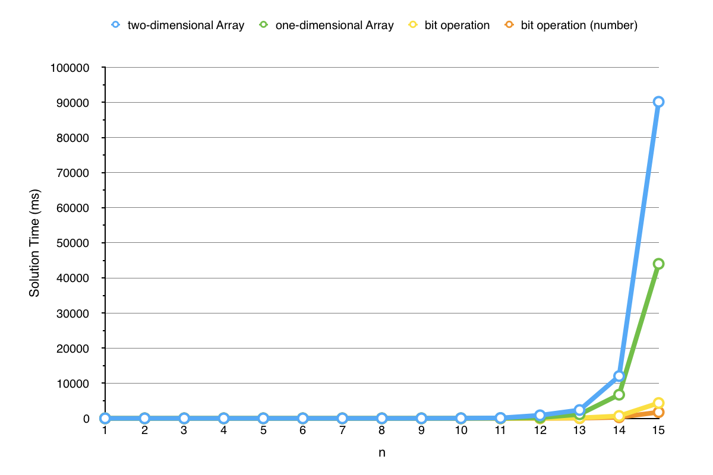

# N-Queens
## Description
(From [LeetCode](https://leetcode.com/problems/n-queens/))

The n-queens puzzle is the problem of placing n queens on an n×n chessboard such that no two queens attack each other.

Given an integer n, return all distinct solutions to the n-queens puzzle.
Each solution contains a distinct board configuration of the n-queens' placement, where `Q` and `.` both indicate a queen
 and an empty space respectively.
For example, there exist two distinct solutions to the 4-queens puzzle:
```
[
 [".Q..",  // Solution 1
  "...Q",
  "Q...",
  "..Q."],

 ["..Q.",  // Solution 2
  "Q...",
  "...Q",
  ".Q.."]
]
```

## Algorithm
1. Backtracking by two-dimensional boolean array representing the whole chessboard
2. Backtracking by one-dimensional int array representing the queen position in every line
3. Based on method 2, using bit operation to decide whether the position is feasible
4. Based on method 3, removing the function of displaying chessboard

## Performance Analysis
Method 1 to 3 have the function of displaying chessboard.
Method 4 can only get the solution numbers.


## Solution Number
|   n   | Solution Number |
| :---- | :--------- |
|   1   |  1         |
|   2   |  0         |
|   3   |  0         |
|   4   |  2         |
|   5   |  10        |
|   6   |  4         |
|   7   |  40        |
|   8   |  92        |
|   9   |  352       |
|   10  |  724       |
|   11  |  2680      |
|   12  |  14200     |
|   13  |  73712     |
|   14  |  365596    |
|   15  |  2279184   |
|   16  |  14772512  |
|   17  |  95815104  |
|   18  |  666090624 |
|   19  |  1         |
|   20  |  1         |


#### Reference: 
1. [N皇后问题的两个最高效的算法](http://blog.csdn.net/hackbuteer1/article/details/6657109)
2. 